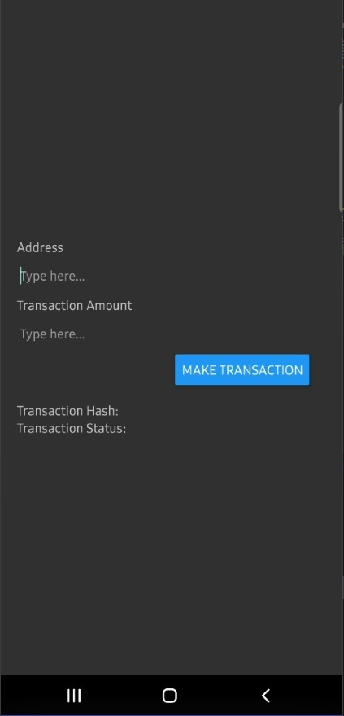
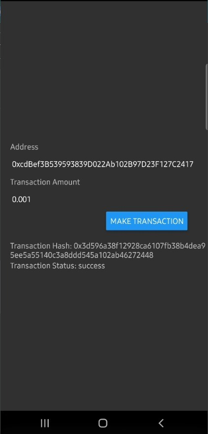
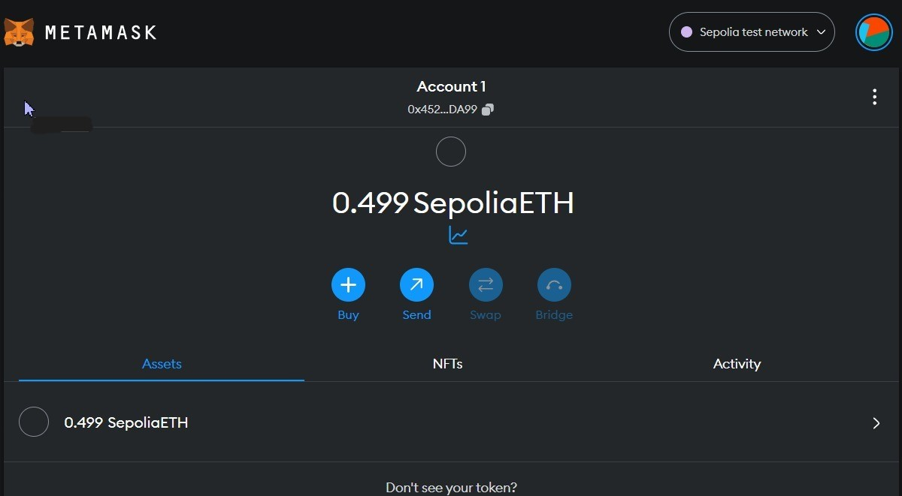
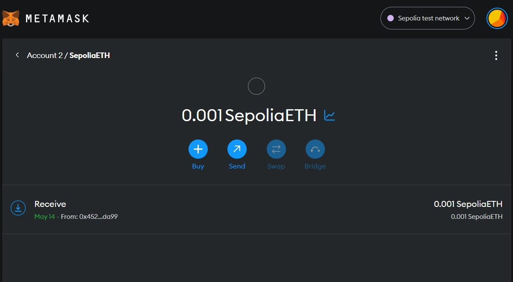

<h1 align="center">Ethereum Transaction App with React Native</h1>

## About
This is a simple React Native application that allows users to send Ethereum transactions to a specific recipient using their private key. The app utilizes the Web3 library to interact with the Ethereum blockchain through the Infura WebSocket node.

## Demo
<p align="center">
  
  
</p>
<p align="center">
  
  
</p>


## Prerequisites
To run this app locally, ensure you have the following installed on your system:
- Node.js
- npm

## Getting Started
1. Clone this repository to your local machine using the following command:
   ```
   $ git clone https://github.com/apurbar06/ethtransfer
   ```

2. Install the necessary dependencies:
   ```
   $ npm install
   ```

3. Update Private Key and Infura Node URL:
   In the `app.tsx` file, replace the `privateKey` variable with your own Ethereum private key. Additionally, if you want to use a different Infura node URL, modify the `web3` instantiation to use your desired URL.

4. Running the App:
   To start the development server and run the app on your connected Android or iOS device or emulator, use the following command:
   ```
   $ npx react-native run-android
   # or
   $ npx react-native run-ios
   ```

## How to Use
1. Address: Enter the recipient's Ethereum address in the "Address" field.
2. Transaction Amount: Enter the amount of Ethereum you want to send in the "Transaction Amount" field.
3. Make Transaction: Click the button to initiate the Ethereum transaction.
4. Transaction Hash: After sending the transaction, the hash will be displayed at the buttom.
5. Transaction Status: The app will show the status of the transaction (pending, success, or failed) once the transaction is processed.

   
## Acknowledgments
Special thanks to the authors of the Web3 and React Native libraries, which made this project possible.

## License
This app is released under the MIT License.
